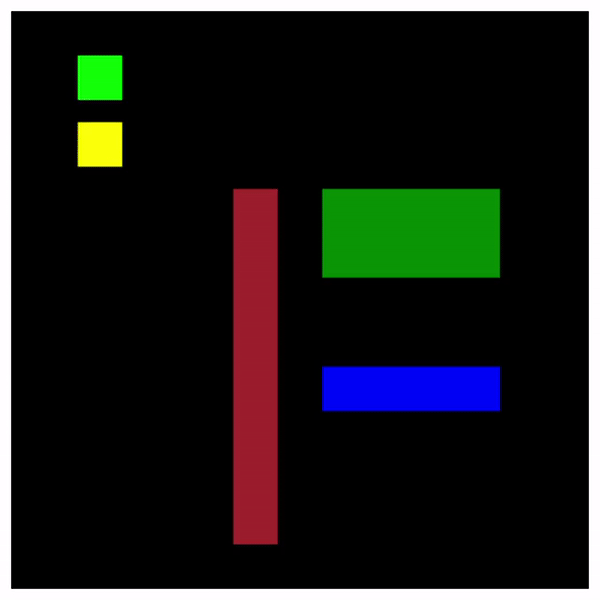

# Игровой движок Tanchiki (Battle City / Tank N 1990)

- [Базовые классы](#базовые-классы)
  - [Game](#game)
  - [Zone](#zone)
  - [View](#view)
  - [Controller](#controller)
  - [Overlay](#overlay)
  - [Entity](#entity)
  - [Terrain](#terrain)
  - [EntityDynamic](#entitydynamic)
  - [Tank](#Tank)
  - [Projectile](#Projectile)
  - [Flag](#flag)
- [Вспомогательные классы](#вспомогательные-классы)
  - [EventEmitter](#eventemitter)
- [Будущие классы](#будущие-классы)
  - [User](#user)
  - [Scenario](#scenario)
  - [Sound](#sound)
  - [PowerUp](#powerup)
  - [EnemyAI](#enemyai)

---

---

## Базовые классы

### Game

Основной сервис, в котором запускается игровой цикл (loop) и инициализируются все основные игровые сервисы и объекты. Цикл работает с заданным интервалом (loopTimeMs), перебирая массив объектов (loopEntities), в которых отслеживаются изменения.

### Zone

Сервис игровой зоны, который содержит матрицу (трехмерный массив 3х56х56) - карту местности, где указано расположение всех игровых объектов (танки и стены на одном слое, снаряды - на другом, бонусы - на третьем). Их нужно зарегистрировать (add), чтобы данные о них автоматически обновлялись (через подписки на события). Выполняет проверку на столкновение объектов (hasCollision).

### View

Графический сервис. Содержит пять наложенных друг на друга канвасов (слоёв), на которых отрисовываются разные типы объектов. Их нужно зарегистрировать (add), чтобы они автоматически перерисовывались при изменениях (обновление через подписки на события).

_Пока что используются цветные прямоугольники, нужно будет потом приделать изображения в виде спрайтов._

### Controller

Сервис управления. Ловит нажатия клавиш на клавиатуре (две раскладки - WASD+пробел или стрелки+энтер), которые затем можно снять через соответствующие события.

_Нужно будет потом добавить поддержку других контроллеров (виртуальные кнопки, джостики)._

### Overlay

Отрисовывает игровое меню, экраны начала и завершения игры с соответствующими анимациями.

### Screen

Абстрактный базовый класс, наследуется от Overlay. Используется для реализации рендера экранов (главное меню, селектор уровней, игра и др.)

### Scenario

Отвечает за игровой сценарий, размещение танков, объектов

### Entity

Абстрактная игровая сущность, от которой наследуются все остальные. Содержит общие для всех методы и свойства, связанные с жизненным циклом и позиционированием. Основные:

- shouldBeDestroyed: должен ли объект быть уничтожен (проверяется в игровом цикле Game);
- direction: в какую сторону смотрит объект;
- movable: динамический или статический объект;
- flying: летящий тип (для снарядов);
- crossable: можно ли переезжать через сущность (к примеру, через деревья - можно);
- hittable: можно ли попасть в сущность снарядом (в воду и деревья - нельзя);
- alignedToGrid: стоит ли объект ровно по сетке в соответствии с матрицей Zone (для отрисовки плавных движений объект может иметь дробные координаты);
- lastRect: прямоугольник, где находился объект до начала движения;
- nextRect: прямоугольник, куда собирается двигаться объект;
- spawned: находится ли объект в игре;
- setState(): обновляет состояние объекта и запускает события, которые отлавливаются в других сервисах;
- getRect(): возвращает прямоугольник, в котором находится объект;
- spawn(): размещает объект по заданным координатам;
- despawn(): убирает объект из игры.

_Надо добавить в spawn() механизм поиска свободных клеток рядом, если указанная занята._

### Terrain

Статические сущности (стены, вода, деревья).

_Нужно будет сделать механику разрушения стен._

### EntityDynamic

Абстрактная игровая сущность, которая может двигаться (от неё наследуются танки и снаряды). Содержит свойства и методы, связанные с движением. Основные:

- moving: должен ли объект двигаться;
- stopping: прекращает ли объект движение (он должен стать по целочисленным координатам);
- canMove: может ли объект двигаться дальше;
- movePace: на сколько клеток за раз перемещается объект;
- moveSpeed: скорость движения объекта;
- moveStepsTotal: за сколько игровых циклов объект совершает один ход;
- moveStepsProgress: сколько игровых циклов хода пройдено;
- nextDirection: новое направление, по которому объект начнёт движение после завершения полного хода;
- getMoveSteps(): рассчитывает количество игровых циклов для одного хода с поправкой на скорость;
- getMoveStepPace(): рассчитывает расстояние, на которое объект пересместится за один игровой цикл;
- update(): вызывается в каждом игровом цикле для определения необходимости двигаться;
- stop();
- turn();
- turnStep(): чтобы объект не начал двигаться сразу после поворота;
- move();
- prepareToMove(): выполняет проверку на то, может ли объект двигаться дальше;
- getNextMove(): рассчитывает координаты следующего хода;
- moveStep(): выполняет микродвижение за игровой цикл;
- stateCheck(): выполняет проверку в каждом игровом цикле (нужна для определения столкновения у снарядов).

### Tank

Танк:

- shoot();
- calculateProjectilePos(): высчитывает стартовую позицию снаряда.

_Нужно будет сделать функционал для ограничения количества выпускаемых снарядов._

### Projectile

Снаряд:

- shouldExplode: даёт дополнительный игровой цикл жизни снарядам, чтобы они могли взрываться друг об друга.

### Flag

Штаб, при разрушении которого игра заканчивается.

---

## Вспомогательные классы

### EventEmitter

Взят из первого модуля (известен также как EventBus). От него наследуются ряд классов для реализации функционала подписок на события.

---

## Будущие классы

### User

_Класс игрока. Функционал начисления очков._

### Scenario

_Игровой сценарий._

### Sound

_Звуковой сервис._

### PowerUp

_Бонусы._

### EnemyAI

_Вражеский ИИ._
